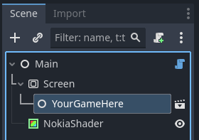
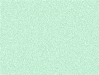
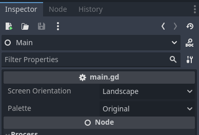
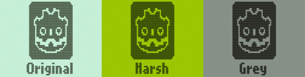
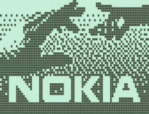

# NokiaJam6

https://itch.io/jam/nokiajam6

Starter for the nokia game jam 6 made for Godot 4.2

# How to use it ?

This project is set to run `main.tscn` on startup. The `Main` scene's structure is as followed:
<p align="center">
    
</p>

The idea is to create your game in a scene like you would normally do.
Instead of running it directly, you simply set it as a child of the `Screen` node.

This project takes care of:
- Nokia’s screen resolution + pixel's aspect ratio
- Input map of the numpad
- Fonts (nokiafc22 & lowrez)
- Visual aspect (color palette and others)
- Framerate (set to 15)
- Snap 2D vertices to pixel is enabled by default

You only have to focus on your game and nothing else.

To help you getting start, you can find a simple example with the Nokia's animated splash-screen in `./scene/NokiaStartup.tscn`.

<p align="center">
    
</p>

## How does it work ?

`Scene` is a `Subviewport` where your game will be rendered. This viewport's resolution is set as 84x48 (or 48x84) pixels.

`NokiaShader` is a `ColorRect` with a shader material that will take the rendered image of `Scene` and apply a filter to make it look like a Nokia 3310's screen.

## Sprites

The shader works with pixels that are either:
- white
- black
- transparent

> It is best if you use png for your sprites.

> Any other color will be translate to its corresponding grayscale value. If this value is less than 0.5, the pixel will be white else it will be black.

If you need to overwrite (or clear) a pixel (eg: from a background), use the a white pixel. In the animated Nokia’s logo, both the hands have white pixels that will "hide" the dithered background.

# Customizing the project

The color palette and the screen orientation can be change directly from the `Main` node:

<p align="center">
    
</p>

## Change the color palette

This jam only allows three palettes: `ORIGINAL`, `HARSH` and `GREY`.

<p align="center">
    
</p>

## Screen orientation to `Portrait` / `Landscape`

By default, this project will display your game in `Landscape` (ie: 84x48), but if you wish, you can change the orientation to `Portrait` (ie: 48x84).

> Nokia's pixels are not squares, in `Landscape` mode, they're slightly taller than they're wide. If you switch the screen orientation to `Portrait`, this project will also invert the aspect ratio of the pixel (they become wider than tall).

## Change the resolution of your game window

Because the SubViewport `Screen` will be rendered directly in `NokiaShader`. You can set the size of the game window directly in your project's settings.

> 💡: You can resize the `NokiaShader` however you like. For example: you can scale it down and place a background image of a nokia 3310 behind it.

## No dithering ?

No, I don't plan to add it to this project.  
But if you need this effect for your game, you can find a complete ordered dithering shader in one my [other repo](https://github.com/Eptwalabha/godot-shaders/tree/main/2D/dithering)

## The `Nokia 3310` shader

The "NOKIA 3310" effect is archived with the shader located in `./assets/shaders/nokial-3310.gdshader`

<p align="center">
    
</p>

### Color palette

The shader will render any pixel "lit" with the color set in `Color White` and all other pixels with the color set in `Color Black`.

A pixel is considered "lit" when:
- its alpha value is not zero
- its grayscale color is over 0.5

> 💡: The grayscale value of a color is: `Red * 0.3 + Green * 0.59 + Blue * 0.11`

### LCD "screen-door" effect

This replicate the gap between pixels:
- `Door Effect`: the gap between pixels (`0`: no gap, `1`: big gap)
- `Door Intensity`: feathered the pixels (`0`: hard edge, `1`: soft edge)

### Pixel shadow

When lit, LCD pixel cast tiny shadows below.
- `Shadow Offset`: the offset of the shadow (eg: `Vector(-0.2, 0.3)` means that the shadow will be on the bottom right of the pixel)
- `Shadow Intensity`: `0`: no shadow, `1`: shadow as dark as a "lit" pixel

### LCD grain

The grainy effect of LCD screen.
- `Grain Amount` to increase/decrease the effect (`0`: no effect, `1.0`: full effect)

### Deactivating an effect

If for some reason, you wish to deactivate one (if not all) of the effects, you can do so by uncommenting the following lines located on top of the shader `./assets/shaders/nokia-3310.gdshader`:

```gdshader
//#define DISABLE_DOOR_EFFECT
//#define DISABLE_PIXEL_GRAIN
//#define DISABLE_PIXEL_SHADOWS
```

Uncommenting one of the lines and saving the shader will recompile it without the corresponding effect. Commenting one of these lines back again will enabled it again.

## Example

You can find an demo scene in `./scene/NokiaStartup.tscn`. To make it work, simply add it as a child of the `Screen` node and launch the project.

# Credits

The font [nokia.ttf](./assets/fonts/nokia/nokia.ttf) was made by [Zeh Fernando](https://portfolio.zehfernando.com/) and is available on [dafont.com](https://www.dafont.com/nokia-cellphone.font) for free.  
If you use this font in your project please credit its author.

All the other assets, including the font [lowrez.png](./assets/fonts/lowrez/lowrez.png) and the images, were created/recreated by me. You are free to use them in any way you like without crediting me, but if you choose to do so… thanks ;)
